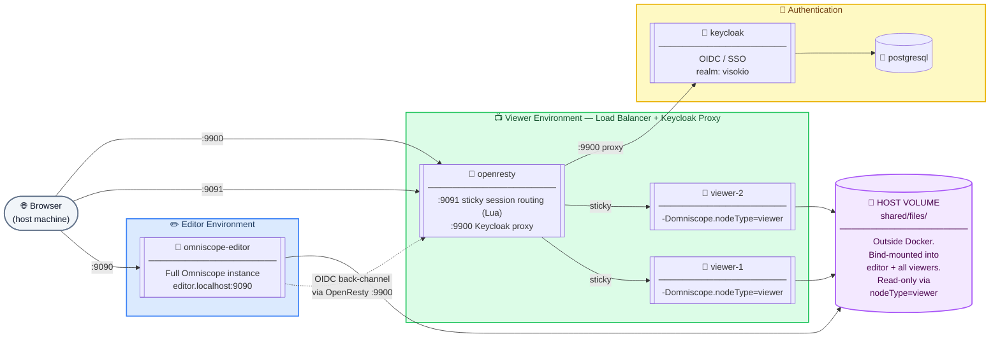
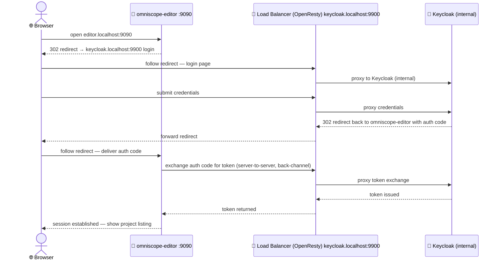
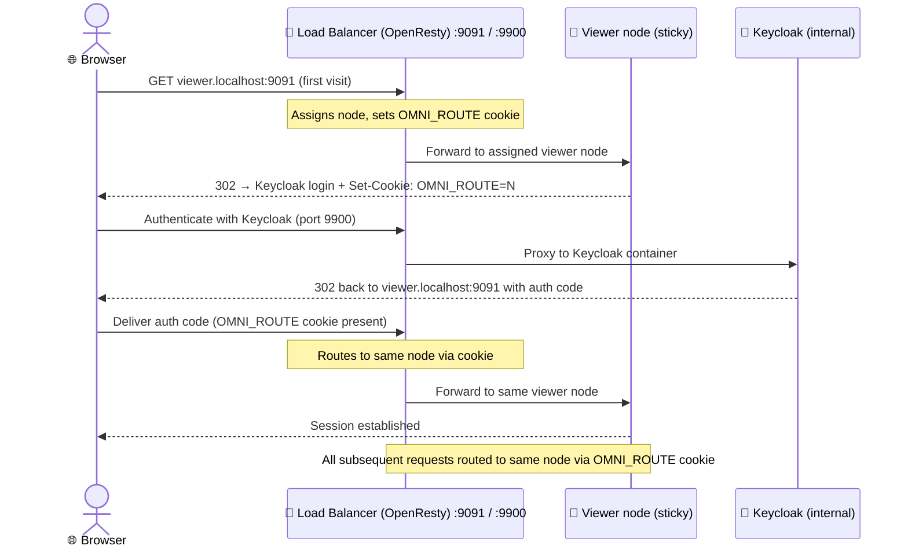
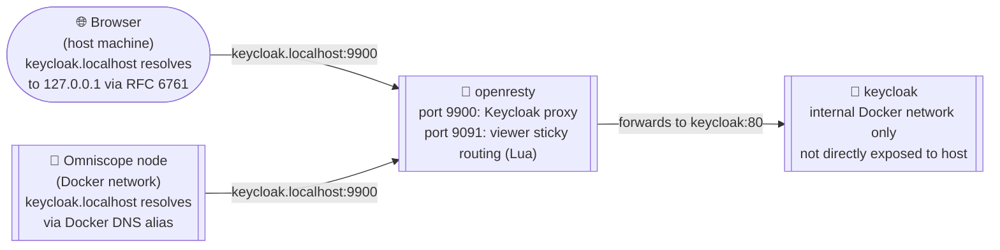

# Omniscope: Multi-Node Docker Reference Deployment

A reference deployment demonstrating Omniscope's multi-node architecture: a single **editor** environment for authoring projects, paired with a horizontally scalable **viewer** cluster for report consumption. All nodes share the same project files, secured with Keycloak OIDC/SSO and load-balanced with sticky sessions.

No host configuration required. Clone, drop in two licence files, and run.

> **Platform note:** The launch scripts were developed and tested on **macOS only**. Linux users should be able to use them (the scripts use POSIX-compatible bash), but we have not tested this. Windows is not supported — the shell scripts would need to be rewritten.

---

## Table of Contents

- [Prerequisites](#prerequisites)
- [Architecture](#architecture)
- [Quick Start](#quick-start)
- [Folder Structure](#folder-structure)
- [Scaling Viewer Nodes](#scaling-viewer-nodes)
- [Resetting Keycloak](#resetting-keycloak)

---

## Prerequisites

| Requirement | Detail |
|---|---|
| **Operating System** | **macOS (tested).** Linux should work (scripts use POSIX-compatible bash) but has not been tested. Windows is not supported — the shell scripts would need to be rewritten. |
| **Docker Desktop** | Allocate at least **6 GB RAM** — Settings → Resources → Memory |
| **Omniscope image** | `docker pull visokio/omniscope:latest` (or `docker pull --platform=linux/amd64 visokio/omniscope:latest` on Apple Silicon Macs) |
| **Licence files** | Two licences: one editor licence, one viewer licence. If you need test licences for a multi-node setup, please get in touch at [support.visokio.com](https://support.visokio.com). |

---

## Architecture

### What multi-node means

Omniscope's multi-node architecture separates the authoring environment from the report-serving environment. Rather than a single server handling both, you run two distinct types of node:

- **Editor nodes** are full Omniscope instances. They can create, modify, and execute projects. In production you typically run one editor cluster for your authoring team.
- **Viewer nodes** are read-only Omniscope instances. They serve reports and dashboards to consumers. You can run as many viewer nodes as you need and scale them independently from the editor.

Both node types share the same project files, so projects published by editors are immediately visible to viewers with no synchronisation step.

> **⚠️ Viewer nodes are for report consumption only.** A viewer node prevents users from creating or modifying projects — this is enforced at the Omniscope application level, not just by file permissions. If your users need to create projects, personalise templates, or do anything that involves writing a new project file, they are acting as editors, not viewers. Those users need access to an editor node with an appropriate editor licence. **This reference deployment does not show how to build a self-service project-creation workflow** — it demonstrates the pure consumption case only.

### What is universal versus what is specific to this reference architecture

The concepts in this architecture apply regardless of where you host Omniscope — on-premises, AWS, GCP, Azure, or any other environment. What changes between environments is only the infrastructure plumbing around the Omniscope nodes themselves.

| Concept | Universal | This Docker Compose reference architecture |
|---|---|---|
| **Editor / viewer node types** | ✅ Standard Omniscope requirement — **all viewer nodes must be started with `-Domniscope.nodeType=viewer`**, regardless of deployment method. Pass it however your platform accepts JVM arguments: system property, startup script, or environment variable. | Passed via the standard `JAVA_TOOL_OPTIONS` environment variable in the Docker Compose service definition — the JVM reads this automatically on startup, no custom image or entrypoint required. |
| **Shared files volume** | ✅ A shared filesystem accessible by all nodes (NFS, EFS, shared disk, etc.) | A host filesystem directory bind-mounted into each container |
| **Sticky session load balancer** | ✅ Any load balancer with sticky session support (ALB, nginx, HAProxy, Kubernetes ingress) | **OpenResty (nginx + Lua)** — an open-source, scriptable web server used here to implement cookie-based sticky routing in a single self-contained container |
| **OIDC / SSO authentication** | ✅ Any OIDC-compliant provider (Entra ID, Okta, Google, AWS Cognito, etc.) | Keycloak running in a container, pre-configured with a test realm |
| **Single Keycloak hostname for browser + back-channel** | 🐳 Docker Compose-specific workaround | OpenResty also acts as a reverse proxy for Keycloak on port `9900`, with a Docker network DNS alias so containers and browsers resolve the same hostname |
| **Project data clean-up on viewer nodes** | ✅ Viewer nodes must never clean up project data — data refresh is always initiated by the editor node. Set `projectDormancy="NEVER"` in each viewer node's config. | Pre-configured in `cluster-data/viewer/omniscope-server/config.xml` — no manual change needed. |

The `keycloak.localhost` proxy is the most Docker Compose-specific piece of this reference architecture. In a production deployment, your OIDC provider has a public hostname that both browsers and your servers can reach directly with no proxy needed. The workaround exists here because Docker containers and the host browser live in different network namespaces and cannot share a simple `localhost` address.

### Docker Compose implementation detail: working-copy callback URLs

Working-copy and project-push flows use server-side callbacks. That means Omniscope (inside the container), not only the browser, must be able to reach the project URL.

How this reference architecture implements that:

- It uses one canonical URL per environment and keeps it routable from both browser and containers.
- Editor URL: `http://editor.localhost:9090`
- Viewer URL: `http://viewer.localhost:9091`
- If a URL is browser-only and not reachable from inside Docker, working-copy actions can fail.
- Do not rely on container-local `localhost` assumptions; inside a container, `localhost` means that same container, not the host machine.

### Two environments, one shared folder

The editor and viewer environments are completely independent Omniscope instances (separate configuration, separate licences, separate user bases) but they share the same underlying projects folder. The editor produces; the viewers consume.

| | Editor environment | Viewer environment |
|---|---|---|
| **Purpose** | Create, modify, and execute projects | Serve pre-built reports — no project creation |
| **Nodes** | Single node | Cluster — scale horizontally |
| **Users** | Project editors and authors | Report consumers only |
| **Licence** | Editor licence (with editor seats) | Viewer licence (unlimited viewers) |
| **Config** | `cluster-data/editor/omniscope-server/` | `cluster-data/viewer/omniscope-server/` |
| **Shared folder** | ✅ Read-write | ✅ Read-write (filesystem level) |
| **URL** | `editor.localhost:9090` — direct to editor node | `viewer.localhost:9091` — OpenResty entry point; optional direct node debug URLs: `viewer-node-1.localhost:19091`, `viewer-node-2.localhost:19092` |

> **`-Domniscope.nodeType=viewer` is a mandatory Omniscope requirement, not a Docker detail.** Every viewer node — whether running in Docker, on bare metal, in Kubernetes, or anywhere else — must be started with this JVM flag. It is what tells Omniscope to operate in viewer mode, preventing users from creating or modifying projects at the application level regardless of what the underlying filesystem permits. How you pass it depends on your platform: via a startup script, a system property, or an environment variable. In this reference architecture it is passed through the standard `JAVA_TOOL_OPTIONS` environment variable in the Docker Compose service definition — the JVM picks it up automatically with no custom image or entrypoint script required. If any of your users need to create projects, save new files, or use template-based project creation workflows, they are editors — they need access to an editor node with an appropriate editor licence. This reference architecture does not cover self-service or template-based project creation.

### Service topology

The diagram uses three distinct visual types — read the legend before diving in.

| Shape | Meaning |
|---|---|
| Rounded rectangle `([ ])` | External actor — exists outside Docker |
| **Double-bordered box** `[[ ]]` | 🐳 Docker container |
| Cylinder `[( )]` | Persistent storage — host filesystem volume, outside Docker |



### Editor request flow



### Viewer request flow



### Sticky session load balancing

#### The architecture requirement: pin each user to one viewer node

Every request a browser makes — page loads, background XHR calls, API requests — must reach the **same viewer node**. Without sticky sessions, background requests can land on a different node that has no session for that user, triggering an authentication challenge and breaking the user's experience.

In production, sticky sessions are standard functionality in virtually all load balancers: AWS ALB, nginx, HAProxy, Kubernetes ingress controllers, and others all support them natively. You configure your existing load balancer to pin each user session to a specific upstream node.

#### How this reference architecture implements it (Docker Compose workaround)

This reference architecture uses **OpenResty** (nginx + Lua) — a scriptable open-source web server that implements cookie-based sticky routing in a single self-contained container with no external dependencies. It sets an `OMNI_ROUTE` cookie on the user's very first request and routes all subsequent requests from that browser to the same viewer node. In production you would replace this with your infrastructure's native sticky session capability.

### Keycloak hostname and the OpenResty proxy

#### The architecture requirement: one shared hostname

OIDC login involves two separate network calls to Keycloak, made by two completely different callers:

1. The **browser** visits Keycloak to show the login page and submit credentials.
2. **Omniscope itself** calls Keycloak server-side to exchange the auth code for a token.

Both callers must use the same hostname. OIDC tokens contain the issuer URI they were minted from. If the browser reached Keycloak at one address and Omniscope reaches it at a different address, the issuer in the token will not match what Omniscope expects, and authentication will fail.

**In production this is straightforward.** Keycloak sits behind a public hostname like `auth.yourcompany.com` that is reachable from both the user's browser and from your Omniscope servers. One hostname, works everywhere, no special arrangement needed.

#### How this reference architecture implements it (Docker Compose workaround)

Docker Compose introduces a networking constraint that production does not have. The browser runs on the host machine. The Omniscope containers run on an internal Docker network where `localhost` inside a container refers to that container itself, not the host. There is no single address that is naturally reachable from both sides.

This reference architecture solves it by giving OpenResty a second role alongside its sticky session routing: it listens on port `9900` and proxies all traffic through to the Keycloak container on the internal Docker network. The hostname `keycloak.localhost` is then configured as the single Keycloak address everywhere, and it reaches OpenResty from both sides:

**From the browser (host machine):** Any `.localhost` subdomain resolves to `127.0.0.1` natively in all modern browsers per RFC 6761, with no `/etc/hosts` entry needed. The browser hits OpenResty at `keycloak.localhost:9900` on the host.

**From inside Docker (Omniscope containers):** OpenResty is registered on the Docker network under the DNS alias `keycloak.localhost`. When Omniscope calls `keycloak.localhost:9900` to complete authentication, Docker's internal DNS resolves that name to OpenResty, which proxies it to Keycloak exactly as it does for the browser.

Both callers reach the same Keycloak instance via the same hostname. Token validation succeeds.



> **This proxy arrangement is a Docker Compose workaround, not part of the Omniscope architecture.** In production, your OIDC provider already has a public hostname reachable from both browsers and servers. OpenResty's Keycloak proxy role would not exist — you would point Omniscope directly at your provider's public URL.

### OIDC configuration

#### The architecture requirement: one OIDC client per environment

Each Omniscope environment (editor and viewer) is configured as a separate OIDC client with its own client ID and redirect URIs. This is a standard OIDC pattern — each application that users log in to registers independently with the identity provider.

The `Automatic login, always` mode silently checks whether the user already has an active session with the OIDC provider. If a session exists, the user is logged in with no prompt. If not, they are redirected to the provider's login page. This also means that if a viewer node goes down and a user is re-routed to another node, the session re-establishes transparently in the background with no manual login required.

#### How this reference architecture implements it (pre-configured Keycloak)

This reference architecture uses Keycloak running in a container, pre-configured with two OIDC clients. These settings are already applied — they are shown here for reference only. To inspect the live settings, on either environment click **Use alternative login** and log in as `Admin` / `admin1234`, then click the profile icon in the top-right corner and go to **Edit permissions** on the root folder.

| Setting | Editor | Viewer |
|---|---|---|
| OIDC enabled | ✅ Yes | ✅ Yes |
| Issuer URI | `http://keycloak.localhost:9900/realms/visokio/` | `http://keycloak.localhost:9900/realms/visokio/` |
| Client ID | `omniscope-editor` | `omniscope-viewer` |
| Login mode | `Automatic login, always` | `Automatic login, always` |

When connecting your own OIDC provider in production, register two clients there — one for the editor, one for the viewer — and use the same settings pattern.

### Permissions configuration

#### The architecture requirement: map identity provider roles to Omniscope permission groups

Permissions in Omniscope are assigned to groups, and each group can be backed by an OIDC role condition. Any user assigned the correct role in the identity provider automatically gets the corresponding access in Omniscope. No Omniscope config changes are needed as users are added or removed — role assignment happens entirely in the identity provider.

#### How this reference architecture implements it (pre-configured Keycloak roles)

This reference architecture pre-configures two roles in Keycloak and maps them to Omniscope permission groups. To inspect the live settings, on either environment click **Use alternative login** and log in as `Admin` / `admin1234`, then click the profile icon in the top-right corner and go to **Edit permissions** on the root folder.

| Permission group | OIDC role required | Environment |
|---|---|---|
| Project editor | `editor-role` | Editor |
| Report viewer | `viewer-role` | Viewer |

When connecting your own OIDC provider, define equivalent roles there, assign them to your users, and map those roles to Omniscope permission groups using the same pattern.

### Keycloak realm reference (reference architecture only)

`cluster-data/keycloak/realm-export/realm.json` is the complete Keycloak realm definition for this reference architecture. It is a standard Keycloak realm export and documents:

- Two OIDC clients: `omniscope-editor` and `omniscope-viewer`
- Two roles: `editor-role` and `viewer-role`
- Test user assignments

Use it as the reference when configuring your own OIDC provider. You can also browse the live configuration at <http://keycloak.localhost:9900> → `visokio` realm → Clients and Roles.

### What is shared across viewer nodes

| Item | Shared? | Notes |
|---|---|---|
| `files/` (projects + saved explorations) | ✅ Yes | Mounted read-write on all nodes — viewer-only behaviour enforced internally by Omniscope |
| `omniscope-server/` config | ✅ Yes | All viewer nodes mount the same config directory |
| User profiles | ✅ Yes | Stored inside `omniscope-server/` — shared across all viewer nodes |
| Bookmarks | ✅ Yes | Stored inside `omniscope-server/` — shared across all viewer nodes |
| Viewer licence | ✅ Yes | One licence file shared across all viewer nodes |
| Per-node logs | ❌ No | Each node gets its own `logs/` directory under `viewer/nodes/node-N/` |
| Per-node error reports | ❌ No | Each node gets its own `error reports/` directory under `viewer/nodes/node-N/` |
| Data engine | ❌ No | Each node has its own Data engine. |

Saved explorations (named and auto-saved) are stored inside the shared `files/` folder and work automatically across all viewer nodes with no extra configuration.

### Two ways to work: staging folder vs. direct

There are two ways editors and viewers can work with shared projects. We recommend the staging folder approach.

**Option A — Recommended: staging folder.** Editors work in a staging working copy that is linked to the master project in the root folder. Viewers only ever open the master project. Nothing the editor does in staging is visible to viewers until the editor explicitly pushes. This means viewers never see partial or mid-refresh data.

**Option B — Direct.** The editor and viewer both work with the same master project in the root folder. The editor opens the project, executes it or makes changes, and the viewer sees those changes automatically within approximately 30 seconds. There is no staging area and no push step. Viewers may briefly see partial data while the editor is executing, so this is not recommended for production.

For step-by-step instructions for both approaches, see [Step 6 — Verify everything is working](#6--verify-everything-is-working) in the Quick Start guide.

### Staging folder: how it works

The staging folder uses Omniscope's **working copy** mechanism. The project inside staging is a linked copy of the master project in the root folder. Editors execute, modify, and validate in staging. When ready, they click **Push** in the workflow toolbar and the master project updates immediately. Viewers open the master project and see the updated version within approximately 30 seconds.

This means:

- **Viewers never see incomplete or mid-refresh data** — they only see a fully refreshed, complete project
- **Data refresh is always owned by the editor node** — viewer nodes never execute workflows themselves
- **The move is atomic** — because the staging folder and the viewer folder are on the same shared filesystem, the move is a rename operation on the same device, which is instantaneous and safe

> This pattern is not specific to this Docker Compose reference architecture — it applies to any Omniscope multi-node deployment regardless of how the shared filesystem is implemented (NFS, EFS, Azure Files, shared network drive, etc.).

### Staging visibility model used in this reference setup

- The `staging` folder is configured with **Hide in parent** enabled.
- To inspect this setting: log in as `Admin` on the editor, open the `staging` folder, click the **profile icon** (top right), then click **Edit permissions**; the **Hide in parent** option is at the bottom.
- This hides the folder from normal parent-folder browsing.
- Editors access staging from the left sidebar through a configured **Virtual Root** named `Staging`. Virtual Roots are named shortcuts to specific folders and can be added, removed, or renamed from the admin section: **profile icon → Admin → Virtual Roots**.
- Viewer users do not have access to staging, so they cannot open it from the sidebar.

---

## Quick Start

### 1 — Clone the repository

```bash
git clone https://github.com/visokio/omniscope-multi-node.git
cd omniscope-multi-node
chmod +x scripts/local-test-compose-cluster.sh
```

The `chmod` step is required — Git does not always preserve execute permissions when cloning, and the launch script will fail without it.

### 2 — Pull the image

**Apple Silicon (M1/M2/M3):**

```bash
docker pull --platform=linux/amd64 visokio/omniscope:latest
```

**Intel/AMD (x86_64):**

```bash
docker pull visokio/omniscope:latest
```

Omniscope is an x86_64 image. On Apple Silicon Macs, Docker runs it under Rosetta 2 emulation, which works reliably but requires the `--platform` flag to pull the correct image variant.

### 3 — Place your licence files

```bash
cp /path/to/editor.lic  cluster-data/editor/licence/Licence.lic
cp /path/to/viewer.lic  cluster-data/viewer/licence/Licence.lic
```

Two separate licences are required: one with editor seats, one for unlimited viewers.

### 4 — Start the cluster

```bash
./scripts/local-test-compose-cluster.sh
```

This script is designed for **clean-slate testing**. Every time it runs it:

1. Stops and removes any existing cluster containers
2. Deletes the previous `cluster-test/` folder and **all data inside it**
3. Seeds a fresh environment from `cluster-data/`
4. Starts all containers and prints a summary of URLs and commands

> **⚠️ All data is destroyed on each run.** Projects, sessions, and any changes made during a previous run are wiped. This is intentional — the script is a test tool, not a persistent environment. To destroy the cluster and clean up at any time, run `cluster-test/delete.sh`.

> **Troubleshooting (intermittent startup race):** If you see lines like `curl: (28) Operation timed out ...` during readiness checks, this is usually a transient host-endpoint timing issue during cold startup, not a broken deployment. Re-run:
>
> ```bash
> ./scripts/local-test-compose-cluster.sh
> ```

### 5 — Open the cluster

**Environments**

| Environment | URL | Credentials |
|---|---|---|
| Editor | <http://editor.localhost:9090> | Click **Use alternative login**, then `Admin` / `admin1234` |
| Viewer | <http://viewer.localhost:9091> | Click **Use alternative login**, then `Admin` / `admin1234` |
| Keycloak admin console | <http://keycloak.localhost:9900> | `admin` / `admin` |

**Direct node access (debug, bypasses load balancer)**

| Node | URL | Notes |
|---|---|---|
| Viewer node 1 | <http://viewer-node-1.localhost:19091> | Direct to `omniscope-viewer-1` (no OpenResty sticky routing) |
| Viewer node 2 | <http://viewer-node-2.localhost:19092> | Direct to `omniscope-viewer-2` (no OpenResty sticky routing) |

Use these only for debugging node-specific behavior (for example, confirming which node has an issue). Normal user traffic should go through <http://viewer.localhost:9091> so sticky sessions and failover behavior match production architecture.

**Pre-configured test users**

| Username | Password | Logs in to |
|---|---|---|
| `editor-user-a` | `editor123` | Editor — <http://editor.localhost:9090> |
| `editor-user-b` | `editor123` | Editor — <http://editor.localhost:9090> |
| `viewer-user-a` | `viewer123` | Viewer — <http://viewer.localhost:9091> |
| `viewer-user-b` | `viewer123` | Viewer — <http://viewer.localhost:9091> |
| `viewer-user-c` | `viewer123` | Viewer — <http://viewer.localhost:9091> |

### 6 — Verify everything is working

The cluster is pre-configured with Keycloak as its OIDC provider. No configuration changes are needed. Follow these steps to confirm that the editor, viewer cluster, shared files, and sticky session routing are all working correctly.

There are two ways to work with this reference architecture. We recommend the **staging folder approach** (Option A), but both are documented below. Before testing either, complete the one-time data seeding step first.

#### Prerequisites — seed project data

This repository does **not** include pre-built project data files. The example ships without data so you must execute each project at least once to generate output. Do this once after every fresh cluster start.

**Seed the root project**

1. Open <http://editor.localhost:9090>.
2. Log in as `editor-user-a`. The password is printed to the console when the cluster starts — check your terminal output.
3. Click on the project to open it.
4. Click the **blue Execute button** to run the project and generate its output data.
5. When execution is complete, click the **Omniscope logo** in the top-left corner to return to the project list.

**Seed the staging project**

6. In the left sidebar, click **Staging** to open the Staging virtual root folder.
7. Click on **[project] (working copy)** to open the staging working copy.
8. Click the **blue Execute button** to execute the staging project.

Both projects are now seeded with data. The root folder project is what viewers will open. The staging working copy is linked to that root project and is what editors use to prepare and validate changes before publishing.

**Confirm the viewer is working before making any changes**

Before testing either workflow, first verify that the viewer can open the seeded data. Open <http://viewer.localhost:9091> in a **different browser or browser profile**. Log in as a viewer user (e.g. `viewer-user-a` / `viewer123`) and open the project. You should see the data produced by the seeding step above. Keep this browser window open — you will use it to confirm changes in the steps below.

---

#### Option A — Recommended: using the staging folder

This is the approach we recommend. The project inside the staging folder is a **working copy** linked to the master project in the root folder — the one that viewers open. The editor works entirely within the staging copy: executing the workflow, adding or modifying report views, and validating the result. Nothing the editor does is visible to viewers until the editor explicitly pushes. At that point the root folder project updates automatically and viewers will see the new version within approximately 30 seconds.

**Step 1 — Open the staging working copy on the editor**

On the editor (<http://editor.localhost:9090>), click **Staging** in the left sidebar to open the staging virtual root folder. Click on **[project] (working copy)** to open it.

> **How the Staging entry appears in the sidebar:** The left sidebar shows **Virtual Roots** — named shortcuts to specific folders that can be configured per user or group. The **Staging** entry is a Virtual Root pointing at the staging folder. You can add, remove, or rename Virtual Roots from the admin section: click the **profile icon** (top right) → **Admin** → **Virtual Roots**. This is how editors get direct sidebar access to the staging folder without it appearing in the main project list that viewers browse.

**Step 2 — Test a data refresh: execute and push**

Run the workflow to refresh the data. When execution is complete, go to the workflow tab and click **Push** in the toolbar. Switch to your viewer browser and open the project — within approximately 30 seconds you should see the updated data. This confirms the data refresh path is working end to end.

> **Working-copy URL rule:** Push and pull callbacks are server-side operations. The project URL must be reachable from inside Docker, not just from your browser. Always use `http://editor.localhost:9090/...` — do not use container-local addresses.

**Step 3 — Test a report edit: add a view and push**

Go back to the editor and open the staging working copy again. Open a report and add or modify a view — for example, add a new chart or table. Once done, push the change to master: go to the workflow tab and click **Push**. Switch to your viewer browser and refresh the project — within approximately 30 seconds the new or modified view should appear in the report.

> **Tip — Pin the report for easier pushing:** If you want to push without navigating away from the report, click the **three-dot menu** inside the report and select **Pin**. This keeps the workflow toolbar visible alongside the report so you can click **Push** directly from that view without switching tabs.

**Step 4 — Optionally use the scheduler**

Instead of executing manually each time, you can automate the staging refresh using the built-in scheduler. In the editor, click the **scheduler icon** in the left sidebar. You will see a pre-configured scheduled action for the staging project. Click the **play button** to trigger an ad hoc run — this executes the staging workflow automatically, as if you had done it by hand. You can also configure it to run on a recurring schedule for nightly or hourly automated refreshes.

The scheduler action also includes a pre-configured **failure notification**. Add your email address to the failure action and Omniscope will send you an alert if the scheduled refresh fails, and a confirmation when it succeeds.

Once the scheduled refresh has run and you are happy with the result, open the staging project, review it, and click **Push** in the workflow toolbar to deploy to the master location that viewers have open.

---

#### Option B — Without staging (direct workflow)

In this simpler approach the editor and viewer both work with the same master project in the root folder directly. The editor opens that project, executes it or makes report changes, and those changes are reflected on the viewer within approximately 30 seconds. There is no staging area and no push step.

This means viewers may briefly see partial or mid-refresh data while the editor is executing, which is why we do not recommend this approach for production. It is useful for understanding the basic shared-file model or for simple setups where that trade-off is acceptable.

**Step 1 — Open the root project on the editor**

Open <http://editor.localhost:9090> and log in as `editor-user-a` (password shown in console logs when the cluster starts). Click on the project in the root folder to open it.

**Step 2 — Test a data refresh: execute**

Run the workflow to refresh the data. Switch to your viewer browser (already open from the seeding confirmation step above) and watch the project — within approximately 30 seconds the viewer will reflect the updated data automatically, with no push required.

**Step 3 — Test a report edit: add a view**

Go back to the editor and open a report. Add or modify a view — for example, add a new chart or table. Switch to your viewer browser — within approximately 30 seconds the new or modified view will appear in the report automatically.

> The viewer and editor are pointing at the same file in the shared folder. There is no push step — changes go live as soon as the editor executes or saves.

**Step 4 — Optionally use the scheduler**

You can also trigger the refresh via the scheduler rather than executing manually. In the editor, click the **scheduler icon** in the left sidebar and click the **play button** next to the non-staging scheduled action. The root folder project will refresh and viewers will see the result within approximately 30 seconds.

### 7 — Stop and destroy the cluster

```bash
cluster-test/delete.sh
```

Stops all containers, removes the Docker network, and deletes the entire `cluster-test/` directory including all runtime data.

---

## Folder Structure

```text
omniscope-multi-node/
├── cluster-data/                          Committed to git — not modified at runtime
│   ├── editor/
│   │   ├── omniscope-server/              Editor bootstrap config (config.xml, serverkey, …)
│   │   └── licence/Licence.lic            🔒 gitignored — place your licence here
│   ├── viewer/
│   │   ├── omniscope-server/              Viewer bootstrap config — shared by all viewer nodes
│   │   └── licence/Licence.lic            🔒 gitignored — place your licence here
│   ├── shared/files/                      Seed projects — copied into cluster-test/ on each start
│   ├── keycloak/realm-export/realm.json   Keycloak realm definition — version controlled
│   └── nginx/nginx.conf                   OpenResty config: sticky routing + Keycloak proxy
│
├── cluster-test/                      Ephemeral runtime state — destroyed by delete.sh
│   ├── editor/omniscope-server/           Runtime editor config (seeded from cluster-data/)
│   ├── viewer/omniscope-server/           Runtime viewer config (shared by all viewer nodes)
│   ├── viewer/nodes/                      Per-node runtime directories — one per viewer node
│   │   ├── node-1/
│   │   │   ├── logs/                      Application logs for viewer node 1
│   │   │   └── error reports/             Crash and error reports for viewer node 1
│   │   └── node-2/
│   │       ├── logs/                      Application logs for viewer node 2
│   │       └── error reports/             Crash and error reports for viewer node 2
│   ├── shared/files/                      Live shared projects folder (host volume)
│   │   └── .tmp/                          JVM temp dir — kept on the same mount for atomic writes
│   ├── keycloak/data/                     Keycloak database — rebuilt from realm.json each run
│   └── delete.sh                            Destroy script — stops containers and deletes this folder
│
└── scripts/
    ├── docker-compose.cluster.yml
    └── local-test-compose-cluster.sh
```

> **Why `.tmp/` lives inside `shared/files/`:** Omniscope uses atomic file rename operations when saving explorations. For an atomic rename to succeed, the source (temp file) and destination must be on the same filesystem mount. The JVM temp directory is set via `-Djava.io.tmpdir` to a `.tmp/` folder inside the `shared/files/` mount, ensuring both are on the same device.

**Volume mounts at runtime**

| Host path (`cluster-test/…`) | Container | Mount target (inside container) | Mode |
|---|---|---|---|
| `editor/omniscope-server/` | omniscope-editor | `/home/omniscope/omniscope-server` | rw |
| `viewer/omniscope-server/` | omniscope-viewer-1/2 | `/home/omniscope/omniscope-server` | rw |
| `viewer/nodes/node-N/logs/` | omniscope-viewer-N | `/home/omniscope/omniscope-server/logs` | rw |
| `viewer/nodes/node-N/error reports/` | omniscope-viewer-N | `/home/omniscope/Visokio Error Reports` | rw |
| `shared/files/` | editor + all viewers | `/home/omniscope/omniscope-server/files` | rw |
| `keycloak/data/` | keycloak-db | `/var/lib/postgresql/data` | rw |
| `cluster-data/editor/licence/` | omniscope-editor | `/home/omniscope/.visokioappdata/Visokio/Omniscope/licenses` | ro |
| `cluster-data/viewer/licence/` | omniscope-viewer-1/2 | `/home/omniscope/.visokioappdata/Visokio/Omniscope/licenses` | ro |
| `cluster-data/nginx/nginx.conf` | openresty | `/usr/local/openresty/nginx/conf/nginx.conf` | ro |
| `cluster-data/keycloak/realm-export/realm.json` | keycloak | `/opt/keycloak/data/import` | ro |

---

## Scaling Viewer Nodes

The default deployment runs **2 viewer nodes**. To add or remove nodes, update these three files consistently:

1. **`scripts/docker-compose.cluster.yml`** — add or remove `omniscope-viewer-N` service blocks
2. **`cluster-data/nginx/nginx.conf`** — add or remove `upstream viewer_nodeN { server omniscope-viewer-N:9090; }` blocks and update the Lua modulus from `count % 2` to `count % N`
3. **`scripts/local-test-compose-cluster.sh`** — add or remove `VIEWER_NODE_N_LOGS` and `VIEWER_NODE_N_ERROR_REPORTS` exports and matching `mkdir` calls

Each additional viewer node requires approximately **1 GB RAM**.

---

## Resetting Keycloak

Keycloak's database is rebuilt from `realm.json` on every fresh run. To reset to a clean state:

```bash
cluster-test/delete.sh
./scripts/local-test-compose-cluster.sh
```
